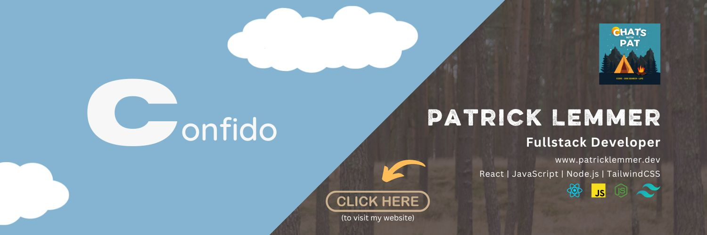

Hi there 👋

My name is Patrick and I am a self-taught/bootcamp grad fullstack developer from Germany. I am currently focused on landing a full-time, remote, entry level role as fullstack developer. 

Working WITH developers for about four years, has made me realise that I want to BE a developer. That's why I made the decision to, use my experience from various positions in operations, and dedicate all my time, money, and efforts, to becoming a fullstack developer.

I have always, and yes I mean always, been good at working on things until they do what they are supposed to do. When others stopped digging in monotone and lengthy pieces of technical documentation, I keep going until I find what I need. As a wildlife photographer I am used to sitting through long periods of time, waiting for that one moment, which by the way often doesn't even happen. But, that has made me a very patient person.

Here are some more things about me:

- 🔭 I’m currently working on ...
A fullstack MERN app. I have decided to use TypeScript for this project, because I would like to 

- 🌱 I’m currently learning ...
TypeScript and the MERN stack in general (see my #buildinpublic project above)

- 👯 I’m looking to collaborate on ...
I would love to start contributing to an open source project.

- 🤔 I’m looking for help with ...

- ⚡ Fun fact: ...

- 📫 How to reach me: ...

# 📩 Latest Blog Posts
<!-- BLOG-POST-LIST:START -->
<!-- BLOG-POST-LIST:END -->
